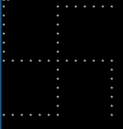

# ✡️ Swastika Pattern

> Print a swastika-shaped star pattern on an n×n grid using nested loop conditions.

---

## 🧩 Problem Statement

Given an odd integer `n`, print an **n × n** swastika pattern using `*` symbols and spaces.

The pattern is formed by:
- A **full cross** — the middle row (`n/2`) and middle column (`n/2`) are all stars
- **Four arms** extending from the cross tips:
  - Top-left arm: left column (`j == 0`) for rows **above** the middle (`i < n/2`)
  - Top-right arm: top row (`i == 0`) for columns **right of** the middle (`j > n/2`)
  - Bottom-left arm: bottom row (`i == n-1`) for columns **left of** the middle (`j < n/2`)
  - Bottom-right arm: right column (`j == n-1`) for rows **below** the middle (`i > n/2`)

Each cell is printed with a trailing space for alignment.

---

## 📥 Input Format

A single odd integer `n` — the size of the grid.

## 📤 Output Format

An `n × n` grid forming a swastika shape using `*` and spaces.

---

## 🔒 Constraints

| Variable | Range |
|----------|-------|
| `n` | 3 ≤ n ≤ 99, n must be odd |

---

## 💡 Example

### Example — n = 7
```
Input:  7
Output:
*   * * * * 
*   *       
*   *       
* * * * * * *
        *   *
        *   *
* * * * *   *
```

### Pattern Visualization



> The cross (middle row + middle column) passes through every cell where `i == n/2` **or** `j == n/2`.  
> The four L-shaped arms complete the rotational swastika shape.

---

## 🧠 Approach

For each cell `(i, j)` in the n×n grid, print `"* "` if **any** of the following conditions are true:

| Condition | Meaning |
|-----------|---------|
| `i == n/2` | Middle (horizontal) row |
| `j == n/2` | Middle (vertical) column |
| `i < n/2 && j == 0` | Left arm — top-left going up |
| `j == n-1 && i > n/2` | Right arm — bottom-right going down |
| `j > n/2 && i == 0` | Top arm — top-right going right |
| `i == n-1 && j < n/2` | Bottom arm — bottom-left going left |

Otherwise print `"  "` (two spaces).

**Time Complexity:** O(n²)  
**Space Complexity:** O(1)

---

## ✅ Solution

```java
import java.util.*;

public class Main {
    public static void main(String[] args) {
        Scanner sc = new Scanner(System.in);
        int n = sc.nextInt();

        for (int i = 0; i < n; i++) {
            for (int j = 0; j < n; j++) {
                if (i == n / 2 || j == n / 2)
                    System.out.print("* ");
                else if (i < n / 2 && j == 0 || j == n - 1 && i > n / 2)
                    System.out.print("* ");
                else if (j > n / 2 && i == 0 || i == n - 1 && j < n / 2)
                    System.out.print("* ");
                else
                    System.out.print("  ");
            }
            System.out.println();
        }
    }
}
```
